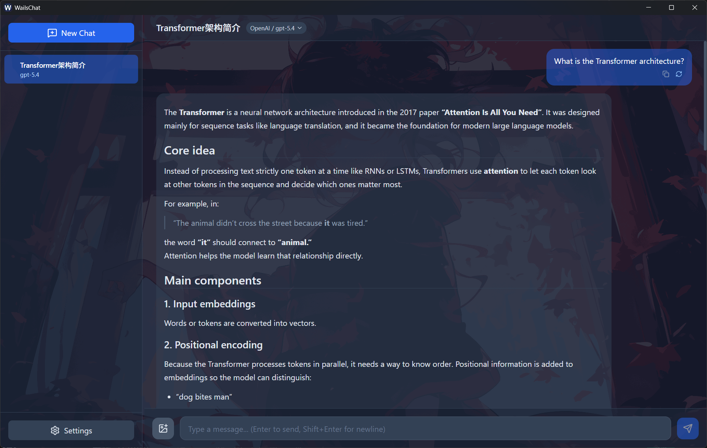
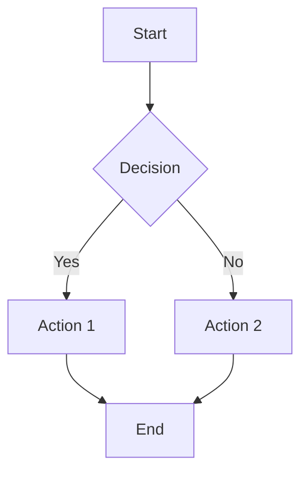

# WailsChat


A desktop AI chat application built with Wails v2 (Go backend + Vue 3 frontend) that connects to OpenAI-compatible LLM APIs with MCP tool calling support.



## Features

- **Multiple LLM Providers**: Support for OpenAI, Claude, DeepSeek, and other OpenAI-compatible APIs
- **Streaming Responses**: Real-time SSE streaming for smooth chat experience
- **Multimodal Support**: Send images to vision-capable models like GPT-4 Vision
- **Multiple Sessions**: Create and manage multiple chat sessions with drag-and-drop reordering
- **Multiple Prompts**: Manage several system prompts and assign one per session
- **Local Storage**: All data stored locally in SQLite database
- **Customizable Settings**: Prompts, theme, fonts, and chat width
- **Theme System**: Built-in light/dark themes plus loadable CSS theme files
- **Built-in Tools (Read/Write/Execute)**: AI models can read local files, write files, and execute shell commands directly
- **MCP Tool Calling**: AI models can use external tools via Model Context Protocol
- **LaTeX Rendering**: High-quality mathematical formula rendering using KaTeX
- **Mermaid Diagrams**: Render flowcharts, sequence diagrams, and more
- **HTML/SVG Code Blocks**: Download rendered HTML/SVG as a file, or preview in a new tab
- **In-chat Search**: Find text within the current conversation (Ctrl+F)
- **Right-click Context Menu**: Quote, copy, retry, and edit-and-resend from any message
- **Drag & Drop**: Drop image files directly into the chat to attach them
- **Performance Statistics**: Token usage, response times, and generation speed tracking
- **Keyboard Shortcuts**: Configurable shortcuts for common actions
- **Custom CSS**: Full CSS customization with highest priority
- **Resizable Sidebar**: Drag to resize sidebar (200-500px)
- **Window State Persistence**: Remembers window position, size, and maximized state
- **Desktop Notifications**: Optional notification when a response finishes generating

## Image Input Features

- **File Selection**: Click the image button to select images from your computer
- **Clipboard Paste**: Directly paste images from clipboard using Ctrl+V
- **Multiple Images**: Send multiple images in a single message
- **Image Preview**: Preview selected images before sending with ability to remove them
- **Vision Model Support**: Compatible with GPT-4 Vision and other vision-capable models

## MCP Tool Calling Features

- **MCP Server Management**: Configure local (stdio) and remote (HTTP) MCP servers
- **Tool Discovery**: Automatic tool discovery from connected servers
- **Real-time Status**: Connection status monitoring with connect/disconnect controls
- **Exponential Backoff Retry**: Automatic reconnection with retry (up to 5 attempts)
- **Environment Variables**: Support for custom environment variables in stdio mode
- **Auth Token**: Optional Bearer token for HTTP transport servers
- **Tool Call Display**: Collapsible panels showing tool arguments and results
- **Error Handling**: Graceful error handling with detailed error messages
- **Iterative Tool Calls**: Support for multiple tool call iterations (up to 10) in a single response

## Built-in Tools (Read/Write/Execute)

AI models can directly use these built-in tools to interact with your local filesystem and execute commands:

### file_read
Read the contents of a local file, or list the entries of a directory.
- **Parameters**: `path` (required, accepts file or directory path), `max_size` (optional, default 100KB, max 1MB, file only)
- **Directory mode**: When a directory path is provided, returns a non-recursive listing showing type (`[DIR]`/`[FILE]`), name, size, and modified time
- **Security**: Path validation prevents directory traversal attacks
- **Use cases**: Reading source code, configuration files, logs, text files; browsing directory structure

### file_write
Create a new file or overwrite an existing file with text content.
- **Parameters**: `path` (required), `content` (required), `create_dirs` (optional)
- **Security**: Dangerous extensions (.exe, .bat, .sh, .ps1, etc.) are blocked
- **Use cases**: Writing code, creating scripts, saving generated content

### shell_exec
Execute a shell command and return the output.
- **Parameters**: `command` (required), `timeout` (optional, default 300s, max 1800s)
- **Security**: Dangerous commands (rm, shutdown, dd, etc.) are blacklisted
- **Use cases**: Running build commands, compiling code, running tests, git operations

**Security Features**:
- Path validation prevents access outside allowed directories
- Dangerous file extensions blocked for write operations
- Command blacklist prevents destructive operations
- Configurable timeout prevents runaway processes
- Results are truncated (10KB max) to prevent context overflow

**Enabling Built-in Tools**:
Built-in tools are disabled by default. Enable them in Settings → Tools tab.

## LaTeX Mathematical Rendering

- **KaTeX Integration**: High-quality math formula rendering
- **Display & Inline Math**: Support for both display (`$$...$$`) and inline (`$...$`) math
- **Alternative Delimiters**: Also supports `\[...\]` and `\(...\)`
- **Error Resilience**: Failed LaTeX renders as plain text with error styling
- **Unicode Support**: Proper handling of Unicode punctuation in markdown

## Mermaid Diagram Support

- **Flowcharts**: Create flowcharts using Mermaid syntax
- **Sequence Diagrams**: Visualize interactions between participants
- **Class Diagrams**: Object-oriented class hierarchies
- **State Diagrams**: State machine visualization
- **ER Diagrams**: Entity-relationship diagrams

Example:
````markdown

````

## Live Development

To run in live development mode, run `wails dev` in the project directory. This will run a Vite development
server that will provide very fast hot reload of your frontend changes. If you want to develop in a browser
and have access to your Go methods, there is also a dev server that runs on http://localhost:34115. Connect
to this in your browser, and you can call your Go code from devtools.

## MCP Server Examples

### Stdio Mode (Local Process)
```bash
# File system server
npx -y @modelcontextprotocol/server-filesystem /path/to/directory

# SQLite server  
npx -y @modelcontextprotocol/server-sqlite /path/to/database.db

# GitHub server
npx -y @modelcontextprotocol/server-github
```

### HTTP Mode (Remote Server)
```
https://api.github.com/mcp
https://custom-mcp-server.example.com
```

Configure MCP servers in Settings → MCP tab.

## Building

To build a redistributable, production mode package, use `wails build`.

## Project Structure

- `main.go` - Application entry point with Wails configuration
- `app.go` - Main application logic with Wails bindings and MCP tool calling
- `window_state.go` - Window position/size/maximized state persistence
- `internal/` - Backend packages
  - `db/` - SQLite database with migrations (V1-V23)
  - `llm/` - OpenAI-compatible API client with streaming and tool calling support
  - `model/` - Data models including MCP types
  - `mcp/` - MCP protocol implementation (JSON-RPC 2.0 client)
  - `tools/` - Built-in tool implementations (file_read, file_write, shell_exec, provide_selection)
  - `provider/` - Provider CRUD service
  - `session/` - Session CRUD service
  - `message/` - Message CRUD service
  - `prompt/` - System prompt CRUD service
  - `settings/` - Settings key-value service
  - `fonts/` - Cross-platform system font enumeration
  - `notify/` - Desktop notifications (Windows toast + cross-platform stub)
- `frontend/` - Vue 3 frontend with TypeScript
  - `src/components/` - UI components
    - `ChatInput.vue` - Message input with image support
    - `ChatWindow.vue` - Chat area with message list
    - `MessageBubble.vue` - Message display with MCP tool call UI
    - `MarkdownMessage.vue` - Markdown rendering with LaTeX, Mermaid, and code-block actions
    - `SettingsModal.vue` - Settings interface with 6 tabs
    - `Sidebar.vue` - Session sidebar
    - `SessionList.vue` - Session list with drag-and-drop
    - `SearchBar.vue` - In-chat Ctrl+F search bar
    - `SelectionPanel.vue` - UI for the `provide_selection` tool
    - `ContextMenu.vue` - Reusable right-click context menu
    - `ProviderModal.vue` - Provider add/edit modal
  - `src/stores/` - Pinia state management (provider, session, message, settings, prompt, search)
  - `src/utils/` - Utilities including markdown.ts
- `build/` - Build configurations and assets

## Database

The application uses SQLite for local storage, located at:
- Windows: `%LOCALAPPDATA%/wailschat/wailschat_data.db`
- macOS: `~/Library/Application Support/wailschat/wailschat_data.db`
- Linux: `~/.config/wailschat/wailschat_data.db`

### Database Schema
- `providers` - API provider configurations
- `sessions` - Chat sessions linked to providers (with sort_order and prompt_id for ordering and prompt assignment)
- `messages` - Chat messages with images, performance stats, reasoning content, and MCP tool data
- `prompts` - Managed system prompts (assignable to sessions via prompt_id)
- `settings` - Application settings (theme, fonts, shortcuts, tools, notifications, etc.)
- `mcp_servers` - MCP server configurations
- `schema_version` - Current migration version (V23)

## Technical Details

### MCP Tool Calling Architecture
1. **Server Configuration**: Configure MCP servers in Settings → MCP tab (stdio or HTTP)
2. **Server Connection**: MCP servers connect on app startup (if enabled) or manually via UI
3. **Tool Discovery**: Tools are fetched via `tools/list` and cached
4. **Tool Injection**: MCP tools are converted to OpenAI function calling format
5. **LLM Interaction**: LLM returns tool calls in streaming response
6. **Tool Execution**: Tools executed via `tools/call` with JSON arguments
7. **Result Integration**: Tool results added to context, LLM continues streaming
8. **Iteration**: Up to 10 tool call iterations supported per message

### LaTeX Rendering Pipeline
1. **Protection**: LaTeX blocks replaced with HTML comment placeholders
2. **Markdown Processing**: Standard markdown processing (code highlighting, bold fixes)
3. **Restoration**: Placeholders replaced with KaTeX-rendered HTML
4. **Error Handling**: Failed renders show original LaTeX with error styling

### Key Technologies
- **Backend**: Go 1.21+, Wails v2, modernc.org/sqlite (CGO-free)
- **Frontend**: Vue 3, TypeScript, Tailwind CSS, Pinia
- **MCP Protocol**: JSON-RPC 2.0 with stdio/HTTP transport support
- **Math Rendering**: KaTeX for LaTeX, highlight.js for code syntax
- **Diagrams**: Mermaid.js for diagram rendering
- **Build System**: Vite, Wails build system

## Development Commands

```bash
# Development mode with hot reload
wails dev

# Production build
wails build

# Frontend development only
cd frontend && npm run dev

# Frontend type checking
cd frontend && npm run type-check

# Go dependency management
go mod tidy
```

## Troubleshooting

### MCP Connection Issues
1. **Check command syntax** for stdio servers
2. **Verify environment variables** are correctly set
3. **Test connection** using the Test button in Settings → MCP
4. **Check logs** for detailed error messages

### LaTeX Rendering Issues
1. **Verify LaTeX syntax** is valid
2. **Check KaTeX compatibility** of LaTeX commands
3. **Ensure proper delimiters** (`$$...$$` for display, `$...$` for inline)

### General Issues
1. **Clear database**: Delete the SQLite file and restart
2. **Check API keys**: Verify provider API keys are valid
3. **Update dependencies**: Run `npm install` and `go mod tidy`

## License

This project uses the official Wails Vue-TS template as a base.
